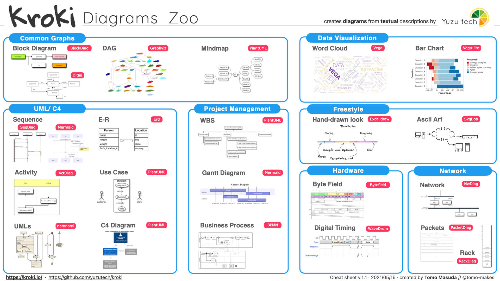
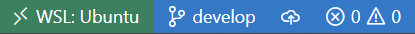

# mkdocs-project-template

Is a template that takes a code-first approach to document projects


It combines the [mkdocs-material](https://squidfunk.github.io/mkdocs-material/) and adds a few extra helpful plugins to handle diagrams, such as:

**Kroki plugin**

Kroki provides a unified API with support for BlockDiag (BlockDiag, SeqDiag, ActDiag, NwDiag, PacketDiag, RackDiag), BPMN, Bytefield, C4 (with PlantUML), D2, DBML, Ditaa, Erd, Excalidraw, GraphViz, Mermaid, Nomnoml, Pikchr, PlantUML, Structurizr, SvgBob, UMLet, Vega, Vega-Lite, WaveDrom... and more to come! 



**Diagrams plugin (diagram as code)**

[Diagrams](https://diagrams.mingrammer.com/) lets you draw the cloud system architecture in Python code.

It was born for prototyping a new system architecture without any design tools. You can also describe or visualize the existing system architecture as well.

Diagram as Code allows you to track the architecture diagram changes in any version control system.

Diagrams currently supports main major providers including: AWS, Azure, GCP, Kubernetes, Alibaba Cloud, Oracle Cloud etc... It also supports On-Premise nodes, SaaS and major Programming frameworks and languages.


## Set up

Clone the repo and open the project's root folder in vscode, then click on green button on the bottom left corner



and select 


**Note:** If the button doesn't appear, is because need to install the [Remote Development Extension](https://marketplace.visualstudio.com/items?itemName=ms-vscode-remote.vscode-remote-extensionpack)

## Commands

The template has multiple commands that you can execute from the vscode terminal

### Run

This command start the server if you are inside the container

e.g.
```bash
make run
```
**Note:** If you are not using VsCode just run `docker-compose up`

after running the command, can visit http://localhost:8000/ to preview the documentation
 